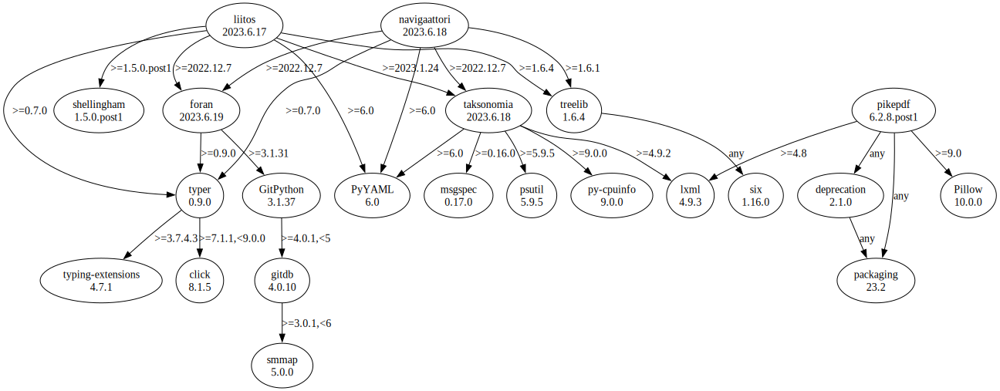

# Third Party Dependencies

<!--[[[fill sbom_sha256()]]]-->
The [SBOM in CycloneDX v1.4 JSON format](https://git.sr.ht/~sthagen/etiketti/blob/default/sbom.json) with SHA256 checksum ([45ed7cc2 ...](https://git.sr.ht/~sthagen/etiketti/blob/default/sbom.json.sha256 "sha256:45ed7cc27fc88cd95c7e01a7e03f957de0741d808a3b64a6da0cf72ca0c397f2")).
<!--[[[end]]] (checksum: 2565c912344149e55562e5d3a9693459)-->
## Licenses 

JSON files with complete license info of: [direct dependencies](direct-dependency-licenses.json) | [all dependencies](all-dependency-licenses.json)

### Direct Dependencies

<!--[[[fill direct_dependencies_table()]]]-->
| Name                                                                                | Version                                                       | License                              | Author          | Description (from packaging data)                        |
|:------------------------------------------------------------------------------------|:--------------------------------------------------------------|:-------------------------------------|:----------------|:---------------------------------------------------------|
| [liitos](https://git.sr.ht/~sthagen/liitos/tree/default/item/README.md)             | [2023.1.21](https://pypi.org/project/liitos/2023.1.21/)       | MIT License                          | Stefan Hagen    | Splice (Finnish liitos) contributions.                   |
| [navigaattori](https://git.sr.ht/~sthagen/navigaattori/tree/default/item/README.md) | [2023.1.17](https://pypi.org/project/navigaattori/2023.1.17/) | MIT License                          | Stefan Hagen    | Navigator (Finnish: navigaattori) guided by conventions. |
| [pikepdf](https://github.com/pikepdf/pikepdf)                                       | [6.2.8.post1](https://pypi.org/project/pikepdf/6.2.8.post1/)  | Mozilla Public License 2.0 (MPL 2.0) | James R. Barlow | Read and write PDFs with Python, powered by qpdf         |
<!--[[[end]]] (checksum: 624b2945314d6a4194bbaa9799251554)-->

### Indirect Dependencies

<!--[[[fill indirect_dependencies_table()]]]-->
| Name                                                                            | Version                                                     | License                 | Author                | Description (from packaging data)                                                                                                         |
|:--------------------------------------------------------------------------------|:------------------------------------------------------------|:------------------------|:----------------------|:------------------------------------------------------------------------------------------------------------------------------------------|
| [click](https://palletsprojects.com/p/click/)                                   | [8.1.3](https://pypi.org/project/click/8.1.3/)              | BSD License             | Armin Ronacher        | Composable command line interface toolkit                                                                                                 |
| [foran](https://git.sr.ht/~sthagen/foran/tree/default/item/README.md)           | [2022.12.7](https://pypi.org/project/foran/2022.12.7/)      | MIT License             | Stefan Hagen          | In front or behind (Danish: foran eller bagved)? Answering the question if a local repository status is in front of or behind its remote. |
| [future](https://python-future.org)                                             | [0.18.3](https://pypi.org/project/future/0.18.3/)           | MIT License             | Ed Schofield          | Clean single-source support for Python 3 and 2                                                                                            |
| [gitdb](https://github.com/gitpython-developers/gitdb)                          | [4.0.10](https://pypi.org/project/gitdb/4.0.10/)            | BSD License             | Sebastian Thiel       | Git Object Database                                                                                                                       |
| [lxml](https://lxml.de/)                                                        | [4.9.2](https://pypi.org/project/lxml/4.9.2/)               | BSD License             | lxml dev team         | Powerful and Pythonic XML processing library combining libxml2/libxslt with the ElementTree API.                                          |
| [msgspec](https://jcristharif.com/msgspec/)                                     | [0.12.0](https://pypi.org/project/msgspec/0.12.0/)          | BSD License             | Jim Crist-Harif       | A fast and friendly JSON/MessagePack library, with optional schema validation                                                             |
| [psutil](https://github.com/giampaolo/psutil)                                   | [5.9.4](https://pypi.org/project/psutil/5.9.4/)             | BSD License             | Giampaolo Rodola      | Cross-platform lib for process and system monitoring in Python.                                                                           |
| [py-cpuinfo](https://github.com/workhorsy/py-cpuinfo)                           | [9.0.0](https://pypi.org/project/py-cpuinfo/9.0.0/)         | MIT License             | Matthew Brennan Jones | Get CPU info with pure Python                                                                                                             |
| [smmap](https://github.com/gitpython-developers/smmap)                          | [5.0.0](https://pypi.org/project/smmap/5.0.0/)              | BSD License             | Sebastian Thiel       | A pure Python implementation of a sliding window memory map manager                                                                       |
| [taksonomia](https://git.sr.ht/~sthagen/taksonomia/tree/default/item/README.md) | [2023.1.10](https://pypi.org/project/taksonomia/2023.1.10/) | MIT License             | Stefan Hagen          | Taxonomy (Finnish: taksonomia) of a folder tree, guided by conventions.                                                                   |
| [treelib](https://github.com/caesar0301/treelib)                                | [1.6.1](https://pypi.org/project/treelib/1.6.1/)            | Apache Software License | Xiaming Chen          | A Python 2/3 implementation of tree structure.                                                                                            |
<!--[[[end]]] (checksum: 2d7c909186914ed08f58a3efad5ac969)-->

## Dependency Tree(s)

JSON file with the complete package dependency tree info of: [the full dependency tree](package-dependency-tree.json)

### Rendered SVG

Base graphviz file in dot format: [Trees of the direct dependencies](package-dependency-tree.dot.txt)



### Console Representation

<!--[[[fill dependency_tree_console_text()]]]-->
````console
liitos==2023.1.21
  - foran [required: >=2022.12.7, installed: 2022.12.7]
    - GitPython [required: >=3.1.29, installed: 3.1.30]
      - gitdb [required: >=4.0.1,<5, installed: 4.0.10]
        - smmap [required: >=3.0.1,<6, installed: 5.0.0]
    - typer [required: >=0.7.0, installed: 0.7.0]
      - click [required: >=7.1.1,<9.0.0, installed: 8.1.3]
  - PyYAML [required: >=6.0, installed: 6.0]
  - taksonomia [required: >=2023.1.10, installed: 2023.1.10]
    - lxml [required: >=4.9.2, installed: 4.9.2]
    - msgspec [required: >=0.12.0, installed: 0.12.0]
    - psutil [required: >=5.9.4, installed: 5.9.4]
    - py-cpuinfo [required: >=9.0.0, installed: 9.0.0]
    - PyYAML [required: >=6.0, installed: 6.0]
  - treelib [required: >=1.6.1, installed: 1.6.1]
    - future [required: Any, installed: 0.18.3]
  - typer [required: >=0.7.0, installed: 0.7.0]
    - click [required: >=7.1.1,<9.0.0, installed: 8.1.3]
navigaattori==2023.1.17
  - foran [required: >=2022.12.7, installed: 2022.12.7]
    - GitPython [required: >=3.1.29, installed: 3.1.30]
      - gitdb [required: >=4.0.1,<5, installed: 4.0.10]
        - smmap [required: >=3.0.1,<6, installed: 5.0.0]
    - typer [required: >=0.7.0, installed: 0.7.0]
      - click [required: >=7.1.1,<9.0.0, installed: 8.1.3]
  - PyYAML [required: >=6.0, installed: 6.0]
  - taksonomia [required: >=2022.12.7, installed: 2023.1.10]
    - lxml [required: >=4.9.2, installed: 4.9.2]
    - msgspec [required: >=0.12.0, installed: 0.12.0]
    - psutil [required: >=5.9.4, installed: 5.9.4]
    - py-cpuinfo [required: >=9.0.0, installed: 9.0.0]
    - PyYAML [required: >=6.0, installed: 6.0]
  - treelib [required: >=1.6.1, installed: 1.6.1]
    - future [required: Any, installed: 0.18.3]
  - typer [required: >=0.7.0, installed: 0.7.0]
    - click [required: >=7.1.1,<9.0.0, installed: 8.1.3]
pikepdf==6.2.8.post1
  - deprecation [required: Any, installed: 2.1.0]
    - packaging [required: Any, installed: 23.0]
  - lxml [required: >=4.8, installed: 4.9.2]
  - packaging [required: Any, installed: 23.0]
  - Pillow [required: >=9.0, installed: 9.4.0]
````
<!--[[[end]]] (checksum: d2450e6590d87fe961aad3ed1ba7c3b0)-->
